# 📊 ERD — لمسة أنوثة POS/ERP
_تاريخ التدقيق: 2026-05-01_

## مخطط العلاقات الكامل (Mermaid)

```mermaid
erDiagram
    %% ══════════════════════════════════════════
    %% A. INFRASTRUCTURE
    %% ══════════════════════════════════════════
    branches {
        int id PK
        text name
        text address
        text phone
        bool is_main
    }
    cities {
        int id PK
        text name
        int branch_id FK
    }
    users {
        int id PK
        text username UK
        text password
        text name
        text role
        int branch_id FK
        bool is_active
        text pin
        decimal salary
        text employment_status
    }

    %% ══════════════════════════════════════════
    %% B. PRODUCTS
    %% ══════════════════════════════════════════
    categories {
        int id PK
        text name
        int parent_id FK
        bool is_active
        int sort_order
    }
    products {
        int id PK
        text barcode UK
        text name
        int category_id FK
        int branch_id FK
        decimal price
        decimal cost_default
        decimal avg_cost
        int stock_qty
        decimal last_purchase_price
        text product_type
        bool is_composite
    }
    product_variants {
        int id PK
        int product_id FK
        text sku UK
        text barcode UK
        text color
        text size
        decimal price
        bool is_default
    }
    product_composite_items {
        int id PK
        int parent_id FK
        int component_id FK
        decimal qty
    }
    price_lists {
        int id PK
        text name UK
        bool active
    }
    price_list_items {
        int id PK
        int price_list_id FK
        int product_id FK
        int variant_id FK
        decimal override_price
    }
    discount_rules {
        int id PK
        text name
        text type
        decimal value
        text applies_to
        bool active
    }

    %% ══════════════════════════════════════════
    %% C. INVENTORY (Dual System)
    %% ══════════════════════════════════════════
    locations {
        int id PK
        int branch_id FK
        text code
        text name
        text type
        bool is_main
    }
    location_inventory {
        int id PK
        int location_id FK
        int product_id FK
        int qty_on_hand
        int reorder_level
    }
    inventory_balances {
        int id PK
        int location_id FK
        int variant_id FK
        int qty_on_hand
        int qty_reserved
    }
    inventory_ledger {
        int id PK
        int variant_id FK
        int location_id FK
        int qty_change
        text reason
        text ref_table
        int ref_id
    }
    inventory_adjustments {
        int id PK
        int branch_id FK
        int location_id FK
        int product_id FK
        text type
        int qty_before
        int qty_change
        int qty_after
        text reason
    }
    stocktakes {
        int id PK
        int branch_id FK
        int location_id FK
        text status
    }
    stocktake_items {
        int id PK
        int stocktake_id FK
        int product_id FK
        int system_qty
        int counted_qty
        int difference
    }
    stock_transfers {
        int id PK
        int from_location_id FK
        int to_location_id FK
        text status
    }
    stock_transfer_lines {
        int id PK
        int transfer_id FK
        int variant_id FK
        int qty
    }

    %% ══════════════════════════════════════════
    %% D. SALES
    %% ══════════════════════════════════════════
    shifts {
        int id PK
        int branch_id FK
        int cashier_id FK
        decimal opening_cash
        decimal total_sales
        decimal expected_cash
        decimal actual_cash
        text status
    }
    sales {
        int id PK
        text invoice_number
        int branch_id FK
        int shift_id FK
        int cashier_id FK
        int customer_id FK
        decimal subtotal
        decimal discount
        decimal vat
        decimal total
        decimal cogs_total
        decimal gross_profit
        text payment_method
        text status
    }
    sale_items {
        int id PK
        int sale_id FK
        int product_id FK
        int quantity
        decimal unit_price
        decimal total
        decimal unit_cost_at_sale
        decimal line_cogs
        decimal line_discount
    }
    sale_returns {
        int id PK
        text return_number
        int sale_id FK
        int branch_id FK
        decimal refund_amount
        text refund_method
        decimal cogs_returned
    }
    sale_return_items {
        int id PK
        int return_id FK
        int sale_item_id FK
        int product_id FK
        int quantity
        decimal unit_price
        decimal line_total
    }
    held_invoices {
        int id PK
        text hold_number
        int customer_id FK
        text items
    }

    %% ══════════════════════════════════════════
    %% E. ORDERS
    %% ══════════════════════════════════════════
    orders {
        int id PK
        text order_number
        int customer_id FK
        int branch_id FK
        int shift_id FK
        int employee_id FK
        text status
        decimal total
        decimal cogs_total
    }
    order_items {
        int id PK
        int order_id FK
        int product_id FK
        int variant_id FK
        int quantity
        decimal unit_price
        decimal total
    }

    %% ══════════════════════════════════════════
    %% F. PURCHASES
    %% ══════════════════════════════════════════
    purchase_invoices {
        int id PK
        text invoice_number
        int supplier_id FK
        int branch_id FK
        decimal grand_total
        decimal vat_amount
        text status
        text payment_method
    }
    purchase_items {
        int id PK
        int purchase_id FK
        int product_id FK
        int qty
        decimal unit_cost_base
        decimal unit_cost_final
        decimal allocated_extra_cost
    }
    purchase_extra_costs {
        int id PK
        int purchase_invoice_id FK
        text type
        decimal amount
    }

    %% ══════════════════════════════════════════
    %% G. STAKEHOLDERS
    %% ══════════════════════════════════════════
    customers {
        int id PK
        text name
        text phone
        int branch_id FK
        decimal total_spent
        int visits
        int invoice_count
    }
    suppliers {
        int id PK
        text name UK
        text phone
        decimal total_purchases
        decimal balance
    }

    %% ══════════════════════════════════════════
    %% H. FINANCE
    %% ══════════════════════════════════════════
    cash_ledger {
        int id PK
        date date
        int branch_id FK
        int shift_id FK
        int cashier_id FK
        text type
        decimal amount_in
        decimal amount_out
    }
    bank_ledger {
        int id PK
        date date
        int branch_id FK
        text method
        decimal amount_in
        decimal amount_out
    }
    expenses {
        int id PK
        int branch_id FK
        int shift_id FK
        text category
        decimal amount
        text source
    }
    accounts {
        int id PK
        text code UK
        text name
        text type
        int parent_id
        bool is_system
    }
    journal_entries {
        int id PK
        text entry_number
        date date
        text description
        text status
        decimal total_debit
        decimal total_credit
    }
    journal_entry_lines {
        int id PK
        int entry_id FK
        int account_id FK
        decimal debit
        decimal credit
    }

    %% ══════════════════════════════════════════
    %% I. PAYROLL
    %% ══════════════════════════════════════════
    payroll_runs {
        int id PK
        text month
        int year
        text status
        decimal total_net
    }
    payroll_details {
        int id PK
        int payroll_id FK
        int employee_id FK
        decimal basic_salary
        decimal net_salary
    }
    salary_payments {
        int id PK
        int payroll_id FK
        int employee_id FK
        decimal amount
    }
    employee_advances {
        int id PK
        int employee_id FK
        decimal amount
        bool settled
        decimal total_repaid
    }
    employee_deductions {
        int id PK
        int employee_id FK
        decimal amount
        text reason
    }
    employee_commissions {
        int id PK
        int employee_id FK
        decimal amount
        text month
        text status
    }
    employee_financial_ledger {
        int id PK
        int employee_id FK
        text movement_type
        decimal amount
        decimal balance_after
    }

    %% ══════════════════════════════════════════
    %% RELATIONSHIPS
    %% ══════════════════════════════════════════
    branches ||--o{ cities : "has"
    branches ||--o{ users : "employs"
    branches ||--o{ products : "owns"
    branches ||--o{ locations : "has"
    branches ||--o{ shifts : "runs"
    branches ||--o{ sales : "records"
    branches ||--o{ orders : "manages"
    branches ||--o{ purchase_invoices : "buys"
    branches ||--o{ expenses : "incurs"
    branches ||--o{ cash_ledger : "tracks"
    branches ||--o{ bank_ledger : "tracks"
    branches ||--o{ customers : "serves"
    
    categories ||--o{ products : "contains"
    categories ||--o{ categories : "parent of"
    
    products ||--o{ product_variants : "has"
    products ||--o{ sale_items : "sold in"
    products ||--o{ purchase_items : "bought in"
    products ||--o{ location_inventory : "stocked in"
    products ||--o{ inventory_adjustments : "adjusted"
    products ||--o{ stocktake_items : "counted"
    
    product_variants ||--o{ inventory_balances : "tracked in"
    product_variants ||--o{ inventory_ledger : "moved in"
    product_variants ||--o{ stock_transfer_lines : "transferred"
    
    users ||--o{ shifts : "opens"
    users ||--o{ sales : "creates"
    users ||--o{ payroll_details : "receives"
    users ||--o{ employee_advances : "takes"
    users ||--o{ employee_deductions : "has"
    users ||--o{ employee_financial_ledger : "has"
    
    shifts ||--o{ sales : "contains"
    shifts ||--o{ expenses : "records"
    shifts ||--o{ cash_ledger : "tracks"
    
    sales ||--o{ sale_items : "has"
    sales ||--o{ sale_returns : "returned via"
    sale_returns ||--o{ sale_return_items : "has"
    
    customers ||--o{ sales : "makes"
    customers ||--o{ orders : "places"
    customers ||--o{ held_invoices : "holds"
    
    suppliers ||--o{ purchase_invoices : "provides"
    
    purchase_invoices ||--o{ purchase_items : "has"
    purchase_invoices ||--o{ purchase_extra_costs : "has"
    
    orders ||--o{ order_items : "contains"
    
    locations ||--o{ location_inventory : "stores"
    locations ||--o{ inventory_balances : "tracks"
    locations ||--o{ inventory_ledger : "logs"
    locations ||--o{ stock_transfers : "from"
    locations ||--o{ stock_transfers : "to"
    
    stock_transfers ||--o{ stock_transfer_lines : "has"
    stocktakes ||--o{ stocktake_items : "has"
    
    payroll_runs ||--o{ payroll_details : "includes"
    payroll_runs ||--o{ salary_payments : "pays via"
    
    journal_entries ||--o{ journal_entry_lines : "has"
    accounts ||--o{ journal_entry_lines : "posted to"
    accounts ||--o{ accounts : "parent of"
```

---

## 🏗️ Architecture Decisions المكتشفة

### 1. نظام المخزون المزدوج
النظام القديم (warehouses/inventory) موجود جنباً لجنب مع النظام الجديد (locations/location_inventory/inventory_balances). هذا يشير إلى migration تدريجي.

### 2. COGS Tracking
يتتبع النظام التكلفة على 3 مستويات:
- `products.avg_cost` — المتوسط المرجّح العام
- `sale_items.unit_cost_at_sale` — التكلفة وقت البيع
- `sale_items.line_cogs` — COGS الفعلي للسطر

### 3. الدفاتر المالية
3 دفاتر منفصلة: `cash_ledger`, `bank_ledger`, `journal_entries` — النظام شبه محاسبي متكامل.

### 4. الرواتب
نظامان: جدول `employees` القديم + `users` الجديد مع حقول salary — المستخدم في الرواتب هو `users`.

_آخر تحديث: 2026-05-01_
